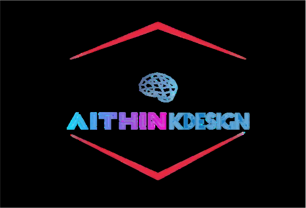

# 🎨 AIThinkDesign - Design Thinking & Prototypage IA

Plateforme complète de conception produit assistée par intelligence artificielle, combinant Design Thinking, TRIZ et génération de prototypes 2D.

> **Projet de Fin d'Études** - 4AS1 2025

## ✨ Fonctionnalités Principales

### 🧠 Design Thinking Assisté par IA
- **Workshops structurés** - Empathie → Idéation → Sélection → Convergence
- **Agents IA multi-personnalités** - Designer, Ingénieur, Utilisateur, Innovateur
- **Streaming temps réel** - Génération d'idées en live via SSE

### 🔄 Analyse TRIZ
- **Identification de contradictions** - Paramètres techniques conflictuels
- **Principes inventifs** - 40 principes TRIZ adaptés
- **Matrice de contradictions** - Résolution guidée

### 🎨 Prototypage IA
- **Génération 2D** - Visuels réalistes ou techniques (FLUX Schnell)
- **Studio autonome** - Création sans workshop préalable
- **Édition IA** - Modification par instructions en langage naturel (Qwen)
- **Nomenclature BOM** - Génération automatique des composants (Gemini)
- **Assistant IA** - Chat contextuel sur les prototypes

## 🏗️ Architecture

### Stack Technique

| Composant | Technologie | Description |
|-----------|-------------|-------------|
| **Frontend** | Next.js 15 | React framework avec App Router |
| **UI** | Shadcn/ui + Tailwind v4 | Composants modernes |
| **Auth & DB** | Supabase | Authentification et base de données |
| **Backend API** | FastAPI (Python) | Workshops et services LLM |
| **LLM** | Google Gemini | Génération de texte et analyse |
| **Images** | Replicate (FLUX) | Génération de prototypes 2D |
| **Édition** | Qwen | Modification d'images par instruction |
| **Monorepo** | Turborepo | Gestion multi-packages |

### Structure du Projet

```
projet_rouge/
├── next-supabase-saas-kit-lite/     # Frontend Next.js
│   ├── apps/web/                     # Application principale
│   │   ├── app/home/designer/        # Module Designer
│   │   ├── lib/replicate/            # Client API IA
│   │   └── api/prototyping/          # APIs prototypage
│   └── packages/                     # Composants partagés
│
└── generative-designer/              # Backend FastAPI
    ├── modules/generative_designer/  # Code source
    │   ├── api/                      # Endpoints REST
    │   ├── core/                     # Services métier
    │   └── models/                   # Schémas Pydantic
    └── migrations/                   # Scripts SQL
```

## 🚀 Getting Started

### Prerequisites

- Node.js 18.x or later (preferably the latest LTS version)
- Python 3.11+
- Docker
- PNPM

Please make sure you have a Docker daemon running on your machine. This is required for the Supabase CLI to work.

### Installation

#### 1. Clone this repository

```bash
git clone https://github.com/Marc1T/AITHINKDESIGN-frontend.git
```

#### 2. Install dependencies

```bash
pnpm install
```

#### 3. Start Supabase

Please make sure you have a Docker daemon running on your machine.

Then run the following command to start Supabase:

```bash
pnpm run supabase:web:start
```

Once the Supabase server is running, please access the Supabase Dashboard using the port in the output of the previous command. Normally, you find it at [http://localhost:54323](http://localhost:54323).

You will also find all the Supabase services printed in the terminal after the command is executed.

##### Stopping Supabase

To stop the Supabase server, run the following command:

```bash
pnpm run supabase:web:stop
```

##### Resetting Supabase

To reset the Supabase server, run the following command:

```bash
pnpm run supabase:web:reset
```

##### More Supabase Commands

For more Supabase commands, see the [Supabase CLI documentation](https://supabase.com/docs/guides/cli).

```
# Create new migration
pnpm --filter web supabase migration new <name>

# Link to Supabase project
pnpm --filter web supabase link

# Push migrations
pnpm --filter web supabase db push
```

#### 4. Start the Next.js application

```bash
pnpm run dev
```

The application will be available at http://localhost:3000.

#### 5. Code Health (linting, formatting, etc.)

To format your code, run the following command:

```bash
pnpm run format:fix
```

To lint your code, run the following command:

```bash
pnpm run lint
```

To validate your TypeScript code, run the following command:

```bash
pnpm run typecheck
```

Turborepo will cache the results of these commands, so you can run them as many times as you want without any performance impact.

## Project Structure

The project is organized into the following folders:

```
apps/
├── web/                      # Next.js application
│   ├── app/                  # App Router pages
│   │   ├── (marketing)/      # Pages publiques
│   │   ├── auth/             # Authentification
│   │   └── home/
│   │       └── designer/     # Module Designer AIThinkDesign
│   │           ├── workshops/     # Gestion workshops
│   │           ├── prototype/     # Hub prototypage
│   │           │   └── studio/    # Studio autonome
│   │           └── prototyping/   # Prototypage lié workshop
│   ├── lib/replicate/        # Client API Replicate + Gemini
│   ├── api/prototyping/      # APIs prototypage (generate, edit, bom)
│   ├── supabase/             # Database & migrations
│   └── config/               # App configuration
│
packages/
├── ui/                       # Shared UI components (Shadcn)
└── features/                 # Core feature packages
    ├── auth/                 # Authentication logic
    └── ...
```

For more information about this project structure, see the article [Next.js App Router: Project Structure](https://makerkit.dev/blog/tutorials/nextjs-app-router-project-structure).

### Environment Variables

You can configure the application by setting environment variables in the `.env.local` file.

Here are the available variables:

| Variable Name | Description | Default Value |
| --- | --- | --- |
| `NEXT_PUBLIC_SITE_URL` | URL de l'application | `http://localhost:3000` |
| `NEXT_PUBLIC_PRODUCT_NAME` | Nom du produit | `AIThinkDesign` |
| `NEXT_PUBLIC_SITE_TITLE` | Titre du site | `AIThinkDesign - Design Thinking & Prototypage IA` |
| `NEXT_PUBLIC_SUPABASE_URL` | URL Supabase | `http://127.0.0.1:54321` |
| `NEXT_PUBLIC_SUPABASE_ANON_KEY` | Clé anon Supabase | |
| `SUPABASE_SERVICE_ROLE_KEY` | Clé service role Supabase | |
| `REPLICATE_API_TOKEN` | Token API Replicate | |
| `NEXT_PUBLIC_BACKEND_URL` | URL backend FastAPI | `http://localhost:8000` |
| `NEXT_PUBLIC_SUPABASE_ANON_KEY` | The anon key of your Supabase project | ''
| `SUPABASE_SERVICE_ROLE_KEY` | The service role key of your Supabase project | ''

## Architecture

This starter kit uses a monorepo architecture.

1. The `apps/web` directory is the Next.js application.
2. The `packages` directory contains all the packages used by the application.
3. The `packages/features` directory contains all the features of the application.
4. The `packages/ui` directory contains all the UI components.

For more information about the architecture, please refer to the [Makerkit blog post about Next.js Project Structure](https://makerkit.dev/blog/tutorials/nextjs-app-router-project-structure).

### Marketing Pages

Marketing pages are located in the `apps/web/app/(marketing)` directory. These pages are used to showcase the features of the SaaS and provide information about the product.

### Authentication

Authenticated is backed by Supabase. The `apps/web/app/auth` directory contains the authentication pages, however, the logic is into its own package `@kit/auth` located in `packages/features/auth`.

This package can be used across multiple applications.

### Gated Pages

Gated pages are located in the `apps/web/app/home` directory. Here is where you can build your SaaS pages that are gated by authentication.

### Database

The Supabase database is located in the `apps/web/supabase` directory. In this directory you will find the database schema, migrations, and seed data.

#### Creating a new migration
To create a new migration, run the following command:

```bash
pnpm --filter web supabase migration new --name <migration-name>
```

This command will create a new migration file in the `apps/web/supabase/migrations` directory. 

#### Applying a migration

Once you have created a migration, you can apply it to the database by running the following command:

```bash
pnpm run supabase:web:reset
```

This command will apply the migration to the database and update the schema. It will also reset the database using the provided seed data.

#### Linking the Supabase database

Linking the local Supabase database to the Supabase project is done by running the following command:

```bash
pnpm --filter web supabase db link
```

This command will link the local Supabase database to the Supabase project.

#### Pushing the migration to the Supabase project

After you have made changes to the migration, you can push the migration to the Supabase project by running the following command:

```bash
pnpm --filter web supabase db push
```

This command will push the migration to the Supabase project. You can now apply the migration to the Supabase database.

## Going to Production

#### 1. Create a Supabase project

To deploy your application to production, you will need to create a Supabase project.

#### 2. Push the migration to the Supabase project

After you have made changes to the migration, you can push the migration to the Supabase project by running the following command:

```bash
pnpm --filter web supabase db push
```

This command will push the migration to the Supabase project.

#### 3. Set the Supabase Callback URL

When working with a remote Supabase project, you will need to set the Supabase Callback URL.

Please set the callback URL in the Supabase project settings to the following URL:

`<url>/auth/callback`

Where `<url>` is the URL of your application.

#### 4. Deploy to Vercel or any other hosting provider

You can deploy your application to any hosting provider that supports Next.js.

#### 5. Deploy to Cloudflare

The configuration should work as is, but you need to set the runtime to `edge` in the root layout file (`apps/web/app/layout.tsx`).

```tsx
export const runtime = 'edge';
```

Remember to enable Node.js compatibility in the Cloudflare dashboard.

## 📍 Routes de l'Application

| Route | Description |
|-------|-------------|
| `/` | Page d'accueil marketing |
| `/auth/sign-in` | Connexion |
| `/auth/sign-up` | Inscription |
| `/home` | Dashboard utilisateur |
| `/home/designer` | Hub Designer AIThinkDesign |
| `/home/designer/workshops` | Liste des workshops |
| `/home/designer/workshops/new` | Créer un workshop |
| `/home/designer/prototype` | Hub prototypage |
| `/home/designer/prototype/studio` | Studio autonome |
| `/home/designer/prototyping/[id]` | Prototypage workshop |
| `/home/designer/prototyping/[id]/results` | Résultats prototypes |
| `/home/designer/prototyping/[id]/assistant` | Chat IA |

## 🔗 Connexion Backend

Le frontend communique avec le backend FastAPI :

```typescript
// Exemple d'appel au backend workshops
const response = await fetch(`${process.env.NEXT_PUBLIC_BACKEND_URL}/workshops`, {
  headers: {
    'Authorization': `Bearer ${jwtToken}`,
  },
});
```

**Backend URL par défaut**: `http://localhost:8000`

## 📚 Documentation

- **Frontend API**: Voir `apps/web/api/` pour les routes API Next.js
- **Backend API**: http://localhost:8000/docs (Swagger UI)
- **Supabase Dashboard**: http://localhost:54323

## License

Ce projet est développé dans le cadre d'un Projet de Fin d'Études.

## 📞 Contact

- **Email**: m.nankouli@edu.umi.ac.ma
- **Projet**: AIThinkDesign - 4AS1 2025

---

**Built with ❤️ using Next.js, Supabase, FastAPI, Gemini AI & Replicate**
